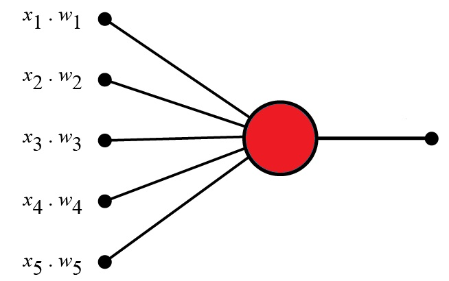

# Perceptron

## 1. What is a perceptron

### 1.1 Definition

A Perceptron is an algorithm for supervised learning of binary classifiers. This algorithm enables neurons to learn and processes elements in the training set one at a time.

Originally, the perceptron was designed to take a number of binary inputs and produce one binary output.

However, if an input was only represented by `1`s and `0`s, it would be difficult to determine which input is more important than the others.

The idea was to use different <ins>weights</ins> to represent the importance of each input. The sum of these weighted values should be greater than a set <ins>threshold</ins> value before making a decision (output).

_Note: we could also call perceptrons neurons_

<p align="center">
  
</p>

<div align="center">
  <em>Visualization of a perceptron</em>
</div>

- `x(n)` = Input
- `w(n)` = Weights

### 1.2 How a perceptron works

<p align="center">
  
</p>

<div align="center">
  <em>Perceptron architecture</em>
</div>

The diagram above represents a <ins>Perceptron Architecture</ins>

- `constant`: Represents the bias term added to ensure the model can make accurate predictions, even when inputs are zero.
- `inputs`: The data values fed into the perceptron for processing.
- `weight`: The weights are coefficients that are dynamically adjusted during training by a learning algorithm (e.g., gradient descent). They are updated based on the error between the predicted output and the actual result, with the goal of minimizing this error over time.
- `weighted sum`: The sum of all inputs multiplied by their corresponding weights, representing the net input to the perceptron.
- `step function`: Often referred to as an Activation Function, this function determines whether the perceptron should fire or remain inactive by producing a binary output based on the weighted sum.

---

## 2. Example:

Let’s simulate how a perceptron processes inputs to make a decision.

### 2.1 Should You Learn Rust?

| Criteria                                                                     | Input (1 or 0) | Weight |
| ---------------------------------------------------------------------------- | -------------- | ------ |
| "You love fighting the borrow checker?"                                      | 1              | 1.0    |
| "You want to write code that's faster than your caffeine intake?"            | 1              | 0.9    |
| "You enjoy syscalls at 3 AM?"                                                | 1              | 0.7    |
| "You dream about the stack and heap?"                                        | 0              | 0.6    |
| "Error: The method exists but the following trait bounds were not satisfied" | 1              | 1.0    |

### 2.2 Based on Frank Rosenblatt

1. Set a threshold value
2. Multiply all inputs with its weights
3. Sum all the results
4. Activate the outputs

**1. Set a threshold value**

`Threshold` = `1.5`

**2. Multiply all inputs with its weights**

```plaintext
x1 × w1 = 1 × 1.0 = 1
x2 × w2 = 1 × 0.9 = 0.9
x3 × w3 = 1 × 0.7 = 0.7
x4 × w4 = 0 × 0.6 = 0
x5 × w5 = 1 × 1.0 = 1
```

**3. Sum all the results**

```plaintext
1 + 0.9 + 0.7 + 0 + 1 = 3.6
```

_The result is called the <ins>Weighted Sum</ins>_

**4. Activate the output**

```python
def activation_function(
    threshold: float = 1.5,
    weighted_sum: float = 3.6
) -> bool:
    """
    Determines if the weighted sum exceeds the threshold.

    Args:
        threshold (float): The threshold value for activation. Default is 1.5.
        weighted_sum (float): The calculated weighted sum. Default is 3.6.

    Returns:
        bool: True if the weighted sum is greater than the threshold, otherwise False.
    """
    return weighted_sum > threshold
```

_The result would be <ins>True</ins> since our `weighted_sum` is bigger than the set `threshold`_

---

## 3.More Information

**Notice how the threshold was 1.5?**

Usually in modern neural networks, outputs from perceptrons will be normalized between a value of `(0,1)` or `(-1,1)`.

We’ll dive deeper into these concepts in later topics, where we explore more complex architectures such as Convolutional Neural Networks (CNNs) for image processing, Natural Language Processing (NLP) models, and advanced techniques like transformers. These models involve handling multiple layers of perceptrons, working with larger datasets, and applying normalization to effectively process complex data like images, text, and sequences.

## 4.Further Topics

- Activation Functions
- Normalization Techniques
- MLP
- Perceptron Learning Algorithms
- Regularization Techniques
- Optimization Techniques
- Architectures
