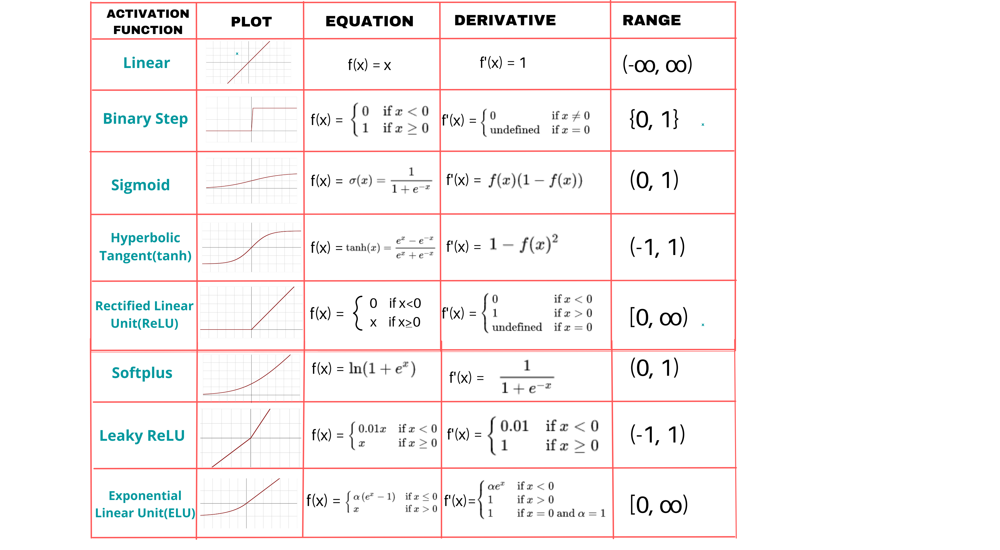

# Activation Functions in Neural Networks

In neural networks, <ins>Activation Functions</ins> play a crucial role by introducing non-linearity, allowing the network to learn complex patterns. Each neuron applies an activation function to its weighted sum of inputs to determine the final output.

  

---

## 1. What is an Activation Function?

An activation function is a mathematical function applied to a neuron's weighted input. It decides whether a neuron should be activated or not, essentially controlling whether the information should pass to the next layer.

### Key Roles of Activation Functions:

- Introduce <ins>non-linearity</ins> into the network
- Help the network learn complex patterns
- Aid in <ins>Backpropagation</ins> and gradient computation

---

## 2. Types of Activation Functions

### 2.1 Linear Activation Function

- **Usage**: Often used in the output layer for regression problems.
- **Pros**: Simple and easy to compute.
- **Cons**: Lacks non-linearity, limiting the network's ability to model complex data.

### 2.2 Sigmoid (Logistic) Function

- **Range**: Output values between 0 and 1.
- **Usage**: Common in binary classification tasks.
- **Pros**: Good for interpreting outputs as probabilities.
- **Cons**: Can cause the **vanishing gradient** problem.

### 2.3 Hyperbolic Tangent (Tanh) Function

- **Range**: Outputs between -1 and 1.
- **Usage**: Preferred over sigmoid in some cases, especially when data needs to be centered.
- **Pros**: Zero-centered output, improving convergence.
- **Cons**: Still suffers from vanishing gradients.

### 2.4 ReLU (Rectified Linear Unit)

- **Range**: Outputs 0 for negative values, `x` for positive values.
- **Usage**: Widely used in hidden layers of deep neural networks.
- **Pros**: Fast and efficient, solves the vanishing gradient issue.
- **Cons**: Can lead to **dying ReLU** problem (neurons stuck outputting 0).

### 2.5 Leaky ReLU

- **Usage**: A variation of ReLU that allows a small gradient when `x < 0` to avoid dead neurons.
- **Pros**: Reduces the dying ReLU issue.
- **Cons**: Adds a small computation overhead.

### 2.6 Softplus Function

- **Range**: Output values between 0 and ∞.
- **Usage**: A smooth version of ReLU that outputs positive values.
- **Pros**: Avoids dead neurons and has smooth gradients.
- **Cons**: Computationally more expensive than ReLU.

### 2.7 Softmax Function

- **Range**: Outputs a probability distribution across multiple classes (values between 0 and 1).
- **Usage**: Typically used in the output layer for multi-class classification tasks.
- **Pros**: Produces a probability distribution, allowing for multi-class classification.
- **Cons**: Computationally more expensive than ReLU, and can sometimes produce high confidence predictions for incorrect classes.

### 2.8 ELU (Exponential Linear Unit)

- **Range**: Output values between `(-α, ∞)` (where α is a hyperparameter typically set to 1).
- **Usage**: Used in hidden layers of neural networks as an alternative to ReLU.
- **Pros**: ELU smooths out the output and allows negative values, reducing bias shifts in neurons. It also avoids the "dying ReLU" problem by having a smooth gradient for negative inputs.
- **Cons**: More computationally expensive than ReLU.

---

## 3. Comparison of Activation Functions

| Activation Function | Range     | Common Usage               | Pros                                 | Cons                      |
| ------------------- | --------- | -------------------------- | ------------------------------------ | ------------------------- |
| Linear              | `(-∞, ∞)` | Regression                 | Simple                               | No non-linearity          |
| Sigmoid             | `(0, 1)`  | Binary Classification      | Smooth, interpretable as probability | Vanishing gradients       |
| Tanh                | `(-1, 1)` | Hidden layers              | Zero-centered, better for training   | Vanishing gradients       |
| ReLU                | `[0, ∞)`  | Hidden layers              | Fast, avoids vanishing gradients     | Dying ReLU issue          |
| Leaky ReLU          | `(-∞, ∞)` | Hidden layers              | Prevents dead neurons                | Slight computational cost |
| Softplus            | `(0, ∞)`  | Hidden layers              | Smooth and avoids dead neurons       | Computationally expensive |
| Softmax             | `(0, 1)`  | Multi-class Classification | Produces probabilities               | Computationally expensive |
| ELU                 | `(-α, ∞)` | Hidden layers              | Smooth gradient, avoids dead neurons | Slight computational cost |

---

## 4. Choosing the Right Activation Function

Choosing the right activation function depends on the task and layer in the neural network:

- **Regression tasks**: Linear or ReLU in the output layer.
- **Binary classification**: Sigmoid in the output layer.
- **Multi-class classification**: Softmax in the output layer.
- **Hidden layers in deep networks**: ReLU or its variants (Leaky ReLU, Softplus, ELU).

---

## 5. Advanced Topics

### 5.1 Activation Functions and Vanishing Gradients

- **Problem**: Certain activation functions (like Sigmoid and Tanh) cause gradients to become very small during backpropagation, slowing down learning.
- **Solution**: Functions like ReLU, Leaky ReLU, and ELU help mitigate this issue by allowing larger gradients, especially in deeper networks.

### 5.2 Activation Functions in Modern Architectures

- **Convolutional Neural Networks (CNNs)**: ReLU is the most commonly used activation function in CNNs.
- **Recurrent Neural Networks (RNNs)**: Often use Tanh or Sigmoid functions, but newer architectures like LSTMs mitigate vanishing gradients better.
- **Transformers**: In modern architectures like Transformers, ReLU or GELU is used alongside attention mechanisms to focus on important parts of the input data.

---

## 6. Conclusion

Activation functions are crucial in determining how a neural network processes information. Choosing the right activation function can have a significant impact on the performance of the model. As neural network architectures evolve, new types of activation functions continue to be developed to handle various challenges, like vanishing gradients and non-linearity.
