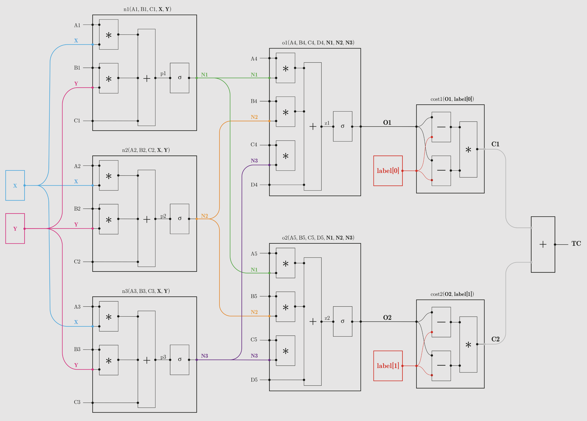

# Layers in Neural Networks

## 1. Layer Connections in Neural Networks

In a neural network, layers are connected sequentially, with each layer passing its output to the next. The connections between layers are defined by **weights** and **biases**, and every neuron in one layer connects to every neuron in the next layer (this is known as a fully connected or dense layer).

### Key Points:

- **Each layer has a specific shape**: This shape defines how many neurons (or units) exist in the layer.
- **Weights**: Between each pair of connected layers, a set of weights defines the strength of the connections.
- **Bias**: A bias term is added to the weighted sum to adjust the output before passing it to the next layer.

## 2. Input Shape and Feature Dimension

When constructing a neural network, the shape of the input data must match the number of features the network expects. The input layer must be carefully designed to match the structure of the input data.

### 2.1 Input Shape

- **Input shape must match the data dimensions**: If the input data has `n` features, the input layer must have exactly `n` neurons to handle this data.
  - Example: If you are working with a dataset where each data point has 100 features, the input layer will have 100 neurons.
- **Images as Input**: For image data, the input shape would depend on the dimensions of the image. A 28x28 pixel grayscale image would have 784 input neurons (since 28x28 = 784 pixels).

### 2.2 Hidden Layer Sizes

- The size of the hidden layers can be flexible. There is no strict rule, but the number of neurons in these layers will define the network's capacity to learn complex representations.
- Hidden layers are connected fully to the previous and the next layers. The number of neurons in the hidden layer is up to the designer and can vary from layer to layer.

### 2.3 Output Shape

- The number of neurons in the output layer should correspond to the task you are solving:
  - **Regression**: One output neuron (for continuous values).
  - **Binary classification**: One output neuron (with an activation function like sigmoid to give probabilities).
  - **Multi-class classification**: One output neuron per class, often with a softmax activation function to predict the probabilities for each class.

## 3. Forward Pass: How Data Moves Through the Layers

During the forward pass, the input data moves through the network layer by layer, undergoing transformations at each stage:

1. **Input Layer**: Receives the raw data.
2. **Hidden Layers**: Perform transformations on the data through a weighted sum of inputs, biases, and activation functions.
3. **Output Layer**: Produces the final predictions based on the activations from the last hidden layer.

The output `a` from one layer becomes the input `x` to the next.

---

## 4. Ensuring Compatibility Between Layers

To ensure the layers in a neural network can pass data correctly to each other:

- **Input shape must match the feature dimension**: The number of neurons in the input layer should be equal to the number of features in your data.
- **Dimensions must align between layers**: For fully connected layers, the output size of one layer should match the input size of the next layer.

### 4.1 Example:

For simplicity, we will use a smaller network.

- Input: 2 Features
- Layer 1 (`dense_1`): 3 neurons
- Layer 2 (`dense_2`): 2 neurons

**Lets visualize**

<p align="center" style="background-color:white;">
  
</p>

<div align="center">
  <em>Visualization of how data flows in a neural network by @nmarincic</em>
</div>

---

## 5. Backpropagation: How Neural Networks Learn

Backpropagation is the algorithm responsible for updating the weights and biases of a neural network during training. After the forward pass (where data flows through the network), backpropagation happens during the training phase to minimize the error between the predicted output and the actual target.

### 5.1 What Is Backpropagation?

- Goal: Adjust the weights and biases to reduce the loss (error) by calculating gradients.
- Process: It computes the gradient of the loss function with respect to each weight by applying the chain rule of calculus.

In simple terms, backpropagation propagates the error from the output layer back to the input layer, adjusting each layer’s weights based on how much they contributed to the error.

### 5.2 Steps in Backpropagation:

1. Calculate the loss (difference between the predicted and actual values) using a loss function (e.g., Mean Squared Error or Cross-Entropy).
2. Compute the gradients for each weight in the network:
   - Gradients indicate how much a change in weight affects the loss.
3. Update the weights:
   - Use an optimization algorithm (e.g., Stochastic Gradient Descent) to adjust the weights in the direction that minimizes the loss.

## 6. Conclusion

The shape of each layer in a neural network must align with the input and output requirements, ensuring data flows smoothly from one layer to another. The connections between layers are defined by weights and biases, and the dimensionality must be carefully managed to prevent mismatches. By ensuring the input layer matches the input features and each subsequent layer is properly connected, we can build a well-functioning neural network.

```

```
