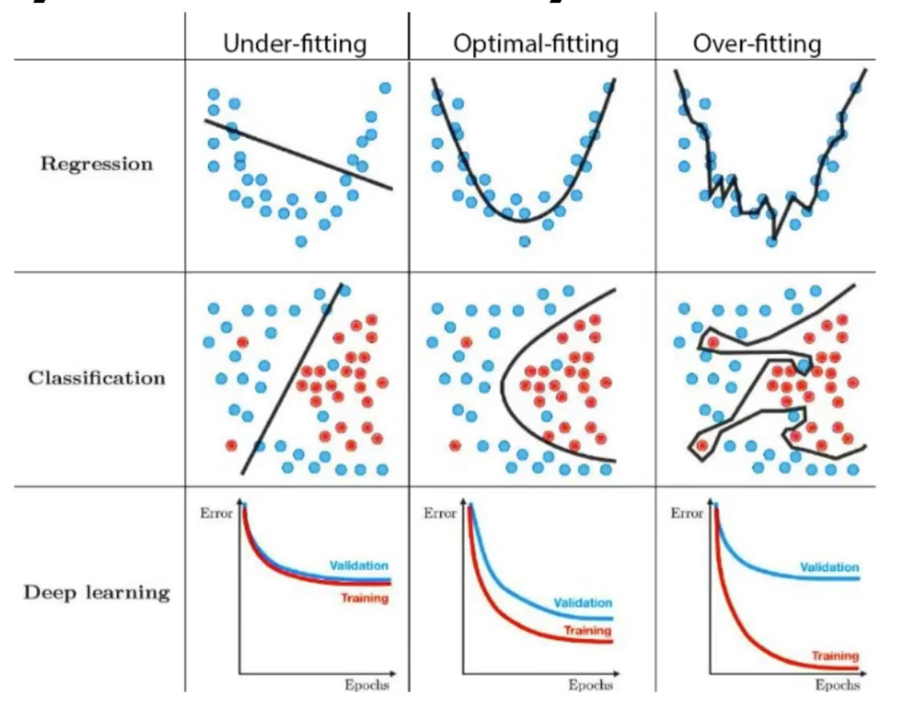

# Overfitting, Underfitting, and Optimal Fitting

  

  <em>Fitting in a graph</em>

## 1. Overfitting

Overfitting happens when a model learns **too much detail** from the training data, capturing not just the underlying patterns but also the noise. As a result, the model performs very well on the training data but **fails to generalize** to new, unseen data.

### Characteristics of Overfitting:

- Low training error, but **high validation/test error**.
- The model is **too complex** relative to the amount of training data.
- The model **memorizes** the training data rather than learning the general patterns.

### How to Prevent Overfitting:

- Use techniques like **regularization** (e.g., L2 regularization).
- Use **dropout** in neural networks.
- Gather **more training data**.
- Apply **early stopping** during training.

---

## 2. Underfitting

Underfitting occurs when the model is **too simple** to capture the underlying patterns in the data. The model fails to learn even the most basic relationships, leading to **poor performance** on both the training and validation datasets.

### Characteristics of Underfitting:

- **High training and validation error**.
- The model is unable to capture the complexity of the data.
- It usually happens when the model is **too simple** or when the data is insufficiently processed.

### How to Address Underfitting:

- Increase the **model complexity** (e.g., add more layers/neurons in a neural network).
- Train for more epochs.
- Remove too much regularization.
- Improve **feature engineering**.

---

## 3. Optimal Fitting

Optimal fitting refers to the situation where a model has the right balance between complexity and simplicity. The model captures the underlying patterns in the data without learning noise, leading to good generalization on both training and unseen data.

### Characteristics of Optimal Fitting:

- **Low training error** and **low validation error**.
- The model generalizes well to new data.
- The model complexity matches the problem at hand.

### How to Achieve Optimal Fitting:

- Use techniques like **cross-validation** to tune hyperparameters.
- Regularize appropriately to avoid overfitting.
- Use a **sufficiently complex model** for the given data.

---

## Summary

- **Overfitting**: The model is too complex and memorizes the data.
- **Underfitting**: The model is too simple and misses important patterns.
- **Optimal fitting**: The model strikes the right balance and generalizes well.
